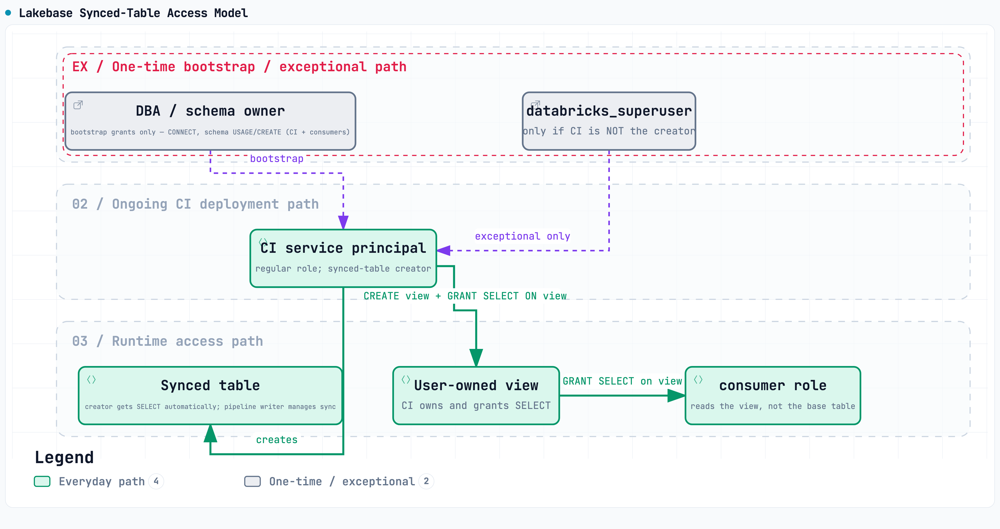
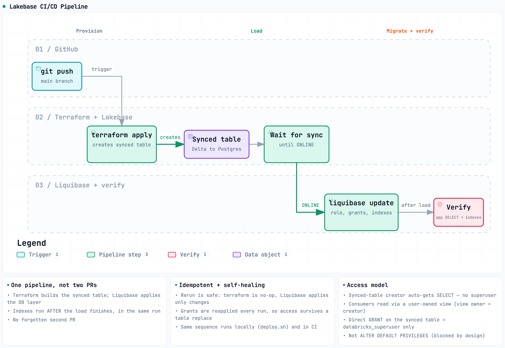

# Databricks Lakebase CI/CD Reference

This repo is a working reference for a CI/CD pipeline on Databricks Lakebase. Lakebase is a
Postgres database for OLTP (online transaction processing) that syncs tables from Delta. The
pipeline creates a synced table, waits for its first load to finish, then applies a database role,
grants, indexes, and a read-only consumer view. It is for data and platform engineers who want a
working blueprint to copy and adapt.

There are two paths in this repo. Databricks Asset Bundles (DABs) is the recommended path if you
are all-in on Databricks. Terraform plus Liquibase is the portable path if you are multi-cloud or
already standardized on Terraform. Both produce the same database objects from the same config file.

> This is sample code, not a turnkey deployment. Point the variables at your own workspace, review
> each step, and run it.

---

## Recommended path: Databricks Asset Bundles (DABs)

DABs (Databricks Asset Bundles) support Lakebase resources directly. That keeps the whole pipeline
on one platform, with fewer outside tools. This is the path a Databricks-first team should start
from.

The flow: edit one config file, generate the bundle resources, then deploy and run. Migrations run
as a Databricks Workflow job. There is no Terraform and no Liquibase on this path.

```bash
# 1. list the tables you want to manage (the single source of truth):
$EDITOR config/tables.json

# 2. generate the bundle resources from that config:
python -m dabs.generate_resources          # writes dabs/resources/*.yml

# 3. from the bundle root, check the bundle (safe to run on a pull request):
cd dabs
databricks bundle validate --target dev \
  --var lakebase_branch=projects/<project-id>/branches/main \
  --var lakebase_database=databricks_postgres \
  --var lakebase_instance=<your-instance>

# 4. on merge, deploy the bundle and run the migration job:
databricks bundle deploy --target dev \
  --var lakebase_branch=... --var lakebase_database=... --var lakebase_instance=...
databricks bundle run lakebase_migration \
  --var lakebase_branch=... --var lakebase_database=... --var lakebase_instance=...
```

`config/tables.json` is the single source of truth. DABs YAML cannot loop a list into many
resources, so `python -m dabs.generate_resources` reads that file and writes one synced table and
one role per entry into `dabs/resources/*.yml`. The generated files are diffable, so re-running
codegen after a config edit is a clean diff. Do not hand-edit them.

### How migrations run

The migration is a bundle-managed Databricks Workflow job. It runs on serverless Python compute
using Alembic. Python is native to job compute, so there is no Java or Liquibase runtime to install.

At run time the job reads `config/tables.json`, waits for every synced table to reach `ONLINE`,
then applies the database objects in order: the read-only role, explicit grants, indexes, and the
consumer view. The steps are idempotent. If a synced table is replaced, the job reapplies them on
the next run. This is reconciliation, not one-time setup.

### Beta status and CLI pin

Lakebase DAB support is Beta. Pin the Databricks CLI to version 1.5.0 or newer. Older CLIs drop the
resource `role_id` and recreate roles, so this pin is a correctness requirement.

### What "all-in on Databricks" does and does not fix for CI

Running the migration inside the job removes the hop from the CI runner to Lakebase. The job itself
connects to Lakebase from inside the workspace. But GitHub Actions still needs to reach the
workspace API to run `bundle deploy` and `bundle run`. A workspace IP access list can block that.
OIDC (OpenID Connect) helps with credentials, not network access. OIDC is a credential exchange,
not network ingress. If a workspace IP access list is in the way, use a runner with allowed egress
(self-hosted or managed), or trigger the Workflow from inside the workspace instead.

---

## The access model (both paths use it)



*Synced tables are owned by a managed writer role whose default privileges you cannot change. The
deploy identity applies explicit grants and owns a consumer view that it can grant freely. So app
access never depends on a privilege no user can hold.*

Synced tables are created and owned by a managed writer role (`databricks_writer_<dbid>`). You
cannot join that role or change its default privileges, not even as a superuser. So the usual
`ALTER DEFAULT PRIVILEGES` approach is a dead end.

The supported path uses two facts:

- The identity that creates the synced table owns it and gets `SELECT`.
- That same identity runs the migration, so it can `CREATE OR REPLACE VIEW` over the synced table.
  Because it owns the view, it can grant consumers `SELECT` on the view.

Consumers read the view, not the base table. Access is granted on an object the deploy identity
owns. It never depends on a privilege no user can hold, and no `databricks_superuser` is needed.

The grant, index, and view steps run on every deploy. They are reapplied after a table replace, so
access comes back on the next run.

### One caveat about self-healing

Reapply-on-every-deploy only restores access if the table replace succeeds. When a consumer view
depends on the table, an in-place replace is blocked. Postgres will not drop a table that still has
a dependent view. So the drop fails, the recreate never happens, and the reapply step never runs.
A plain redeploy does not self-heal in that case. Drop the view first, or stand up the new table
beside the old one and swap. See `docs/DESIGN-NOTES.md`, "Changing sync mode: prefer a blue/green
swap."

---

## Portable alternative: Terraform + Liquibase

Prefer this path if you are multi-cloud or already standardized on Terraform. Terraform provisions
the synced table, GitHub Actions orchestrates the sequence, and Liquibase applies the database
objects. It is built on the Lakebase Autoscaling projects model (`databricks_postgres_*`), which is
the model to build on.



*Terraform creates and loads the synced table. The pipeline waits for the initial load to reach
ONLINE. Liquibase then applies the role, grants, indexes, and view, and verifies access. The
diagram shows this Terraform flow.*

The pipeline is four ordered steps, run the same way by hand (`scripts/deploy.sh`) and by CI:

1. Terraform provisions the synced tables (`databricks_postgres_synced_table`, `for_each` over
   `config/tables.json`). One apply creates them all. Terraform owns its state, so reruns are a
   no-op.
2. Wait for `ONLINE` (`scripts/wait_for_sync.sh`), per table. Poll until the first snapshot has
   loaded. This is what makes indexes build after the data lands, not during the load.
3. Liquibase applies the database objects. Each table runs its OWN generated changelog
   (`liquibase/generated/<name>.changelog.sql`, produced from `config/tables.json` by
   `liquibase/generate_changelogs.py`), in order:
   - `001-app-role` — an idempotent read-only app role.
   - `002-app-grants` — explicit `GRANT USAGE` and `GRANT SELECT` on the writer-owned synced table.
   - `003-index-<col>` — `CREATE INDEX IF NOT EXISTS`, one changeset per `index_columns` entry, after the load.
   - `004-app-view` — a consumer view owned by the deploy identity, with the grant on the view.

   A distinct changelog file per table gives each changeset a distinct identity, so two tables that
   share one `app_schema` never collide in a shared `DATABASECHANGELOG`.
4. Verify. The app role can `SELECT`, and the indexes exist.

The grant, index, and view changesets are `runAlways:true`, so they reapply on every deploy. See
the self-healing caveat above for the one case where a plain redeploy does not restore access.

### Multiple tables (the one-file pattern)

`config/tables.json` is the single source of truth for which tables the pipeline manages. Both
Terraform (`for_each` in `terraform/main.tf`) and the deploy loop (`scripts/deploy.sh`) read it.
Adding a table is a one-line edit there. No Terraform or script changes are needed. Each entry
declares the synced table id, its Delta source, primary key, app schema and role, and any number of
index columns:

```json
[
  {
    "name": "members",
    "synced_table_id": "my_catalog.cicd_proj.members",
    "source_table_full_name": "my_catalog.cicd_proj.members_src",
    "primary_key_columns": ["id"],
    "app_schema": "cicd_proj",
    "app_role": "members_app_ro",
    "index_columns": ["member_id", "plan_code"]
  }
]
```

`terraform apply` runs once and provisions all of them. The deploy loop then generates one
changelog per table, waits for each table's sync, applies the objects, and verifies access. Every
`index_columns` entry becomes its own index changeset (0/1/N — no cap). A table that needs a
different index shape (composite, partial, a different type) edits its generated changelog or
extends the generator. Field-by-field reference: `config/README.md`.

### Branching (test risky changes safely)

```bash
./scripts/branch_test.sh <your-project-id> pr-123
# creates an ephemeral copy-on-write branch, runs your migration against it, then you delete it
```

Two concerns, two tools. For load speed, load first and index after (`CREATE INDEX CONCURRENTLY` so
apps do not block). For a risky rebuild, drop, or move, test on an ephemeral branch, then promote.
Do not use one to solve the other.

### How to run

```bash
export PROFILE=<your-cli-profile>
export WAREHOUSE_ID=<your-sql-warehouse-id>
export HOST=<your-lakebase-rw-endpoint-host>
export PGUSER=<your-databricks-username>

# 1. list your tables (the ONE file most users edit):
$EDITOR config/tables.json

# 2. copy and edit the shared Terraform vars:
cp terraform/terraform.tfvars.example terraform/terraform.tfvars   # edit for your workspace

./scripts/seed_source.sh   # one-time: demo Delta source table + UC schemas
./scripts/deploy.sh        # the pipeline: terraform apply -> per table wait sync -> liquibase -> verify
```

`deploy.sh` is the exact sequence GitHub Actions runs. See `RUNBOOK.md` for the walkthrough and the
CI auth guidance, and `docs/DESIGN-NOTES.md` for the design reasoning.

---

## Migration engines: Alembic and Liquibase

The two paths use different migration tools, but produce the same database objects from the same
`config/tables.json`.

- The DABs path uses Alembic (Python) inside the Workflow job. Python runs on serverless job
  compute with no extra runtime.
- The Terraform path uses Liquibase.

The Alembic migration and the Liquibase changelog line up one to one:

| Liquibase changeset (generated per table) | Alembic equivalent |
|---|---|
| `001-app-role` | `_role_guard_sql` — idempotent `CREATE ROLE` via a `pg_roles` existence guard |
| `002-app-grants` | `_grant_statements` — `GRANT USAGE` on schema + `GRANT SELECT` on the synced table |
| `003-indexes` (generated as one `003-index-<col>` changeset per `index_columns` entry) | `_index_statements` — `CREATE INDEX IF NOT EXISTS` per `index_columns` (handles 0/1/N) |
| `004-app-view` | `_view_statements` — `CREATE OR REPLACE VIEW` + `GRANT SELECT` on the view |

Both stay idempotent. To run the Alembic path outside the job, render the SQL offline and pipe it
to psql on each deploy:

```bash
cd alembic
pip install alembic
LAKEBASE_TABLES_CONFIG=../config/tables.json alembic upgrade head --sql
```

How each path stays idempotent (the reapply-on-every-deploy behavior) is explained in
`docs/DESIGN-NOTES.md`.

---

## Key findings

Verified end to end on the Autoscaling projects model (PostgreSQL 16, Databricks Terraform provider
v1.132.0, Terraform v1.16.2, Liquibase 4.33.0):

- `terraform apply` does NOT block until the sync is `ONLINE`. The resource returns once the synced
  table is created. The initial load runs in the background. Use the `wait_for_sync.sh` gate before
  building indexes, or they try to build on an empty or partial table.
- `CREATE INDEX IF NOT EXISTS` is idempotent, so it is safe to run on every deploy.
- All sync modes keep indexes and grants across a same-mode refresh. A routine re-sync keeps the
  previous copy until the new load finishes. Indexes and grants survive.
- A sync-mode CHANGE forces a full replace that drops indexes and grants down to the primary key.
  This is why the grant, index, and view changesets are `runAlways:true`. Treat a mode change as a
  planned rebuild, not a routine operation. See the self-healing caveat above for the case where a
  dependent view blocks an in-place replace.
- `ALTER DEFAULT PRIVILEGES` on the writer role is denied by design. The explicit-grants plus
  consumer-view pattern is the supported alternative.
- Copy-on-write branches isolate risk. A destructive migration on an ephemeral branch, such as
  dropping an index, leaves the production copy untouched.

---

## Repo layout

```
config/tables.json  single source of truth: the tables to manage (read by DABs codegen, Terraform, and deploy.sh)
dabs/               DABs variant (the recommended lead): databricks.yml, generate_resources.py (codegen), migration_job.py (Alembic job)
dabs/resources/     generated bundle resources (one synced table + role per config entry) — do not hand-edit
terraform/          databricks_postgres_synced_table (for_each over config/tables.json)
liquibase/          changelog: 001 app role, 002 explicit grants, 003 indexes, 004 consumer view
alembic/            Alembic migration (the DABs path's engine; also runnable offline)
scripts/            seed_source.sh, wait_for_sync.sh, deploy.sh, branch_test.sh
.github/workflows/  ci.yml (no-cloud checks incl. offline bundle validate), deploy.yml, pr-validate.yml, pr-cleanup.yml (reference-only; see RUNBOOK CI auth)
docs/               DESIGN-NOTES.md (design reasoning), TROUBLESHOOTING.md, pipeline + access-model diagrams
docs/adr/           architecture decision records — the load-bearing "why"s
examples/           read_via_view.py — a consumer reading a synced table through its view
Makefile            one-command entrypoint for the Terraform path: make help | validate | seed | deploy | branch
CONTRIBUTING.md     local checks + ground rules   |   LICENSE (MIT)
```

Prefer a single entrypoint for the Terraform path? `make help` lists everything. `make validate`
runs the no-cloud checks. Stuck? See `docs/TROUBLESHOOTING.md`.

---

## Prerequisites

Shared:

- A Databricks workspace with a Lakebase Autoscaling project and a `production` branch.
- Databricks CLI, authenticated to your workspace (a named CLI profile).
- A SQL warehouse (for seeding the demo source table) and an existing UC (Unity Catalog) catalog
  and schema.

For the DABs path:

- Databricks CLI 1.5.0 or newer (Lakebase DAB support is Beta).

For the Terraform path:

- Terraform and the `databricks/databricks` provider. This reference was built and tested with
  Terraform 1.16.2 and provider 1.132.0. Use those or newer. The `databricks_postgres_*` resources
  are recent, so do not pin older.
- Liquibase (OSS) 4.33 or newer, and `psql`.

---

## Security notes

- No stored database credentials. The Postgres password is minted at runtime with
  `databricks database generate-database-credential` (short-lived OAuth token, about 1 hour TTL).
  The DABs job mints its token inside the workspace the same way.
- No secrets in the repo. `.gitignore` excludes `*.tfstate*`, `*.tfvars`, `*.env`, and
  `liquibase.properties`. Only `.example` templates are committed.
- Terraform state is gitignored. Keep it in a secure remote backend for real use.
- Recommended CI auth is OIDC (OpenID Connect) / Workload Identity Federation, so no long-lived
  secret is stored in GitHub. See `RUNBOOK.md`, "CI auth".
- The included deploy workflows are reference-only and manual-trigger. Wire them up once auth and
  network access are in place. The `ci.yml` no-cloud checks run on every PR with no secrets.

---

## Credits

Built and maintained by Samuel Selvan — https://github.com/saselvan. Licensed under MIT.
